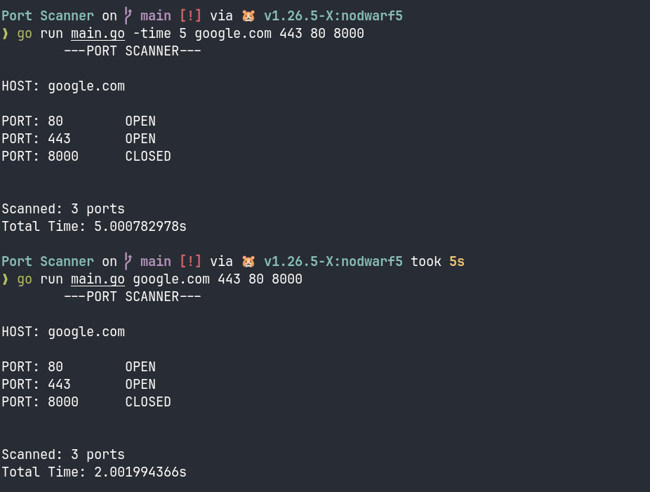

# Port Scanner

A simple concurrent TCP port scanner written in Gooooo...
It scans the ports and gives you information whether they are open or closed. 



## Features 
- TCP port scanning
- Concurrent port scanning using goroutines
- Simple terminal output

## Instalation 

Binaries are avaliable on Releases page.

## Usage 

Provides a host followed by the ports you want to scan

``` ./pscan localhost 22 80 443```

You can scan a remote host as well:

``` ./pscan google.com 443 80 8000 ```

You can also add a flag names -time :
 
 ``` ./pscan -time 5 localhost 22 80 8000 ```

 The timeout is now 5 second


 ## License 

 I am using MIT License for this project :D hehehe
